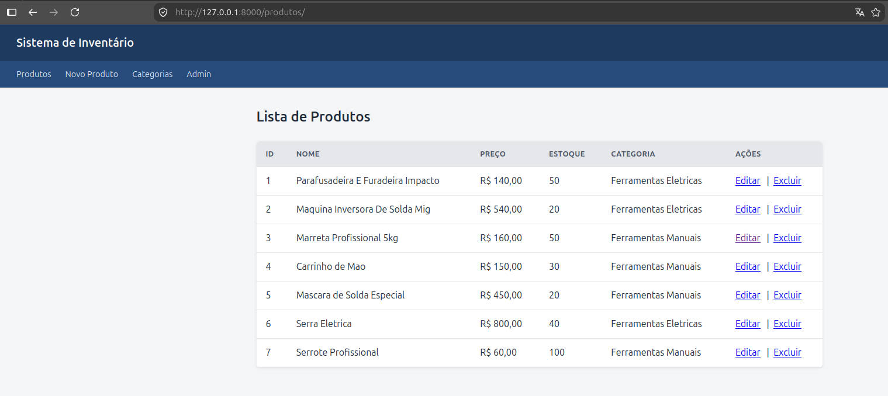
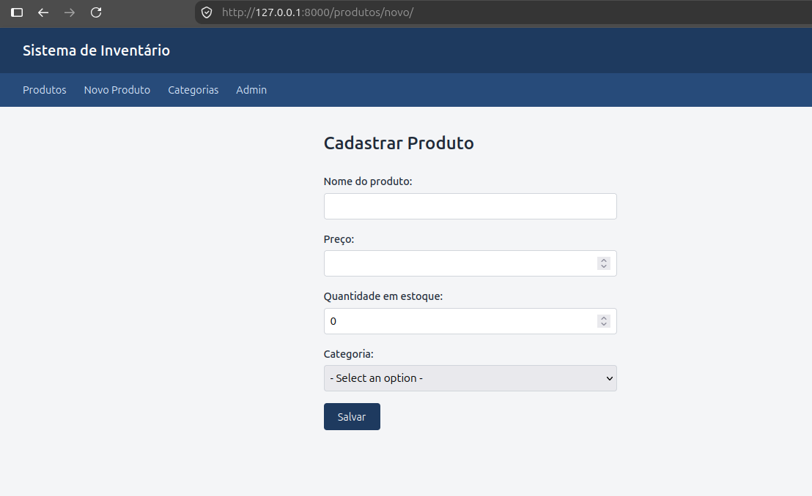
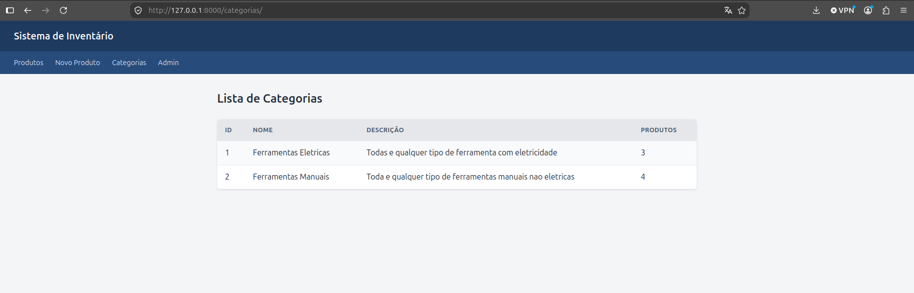

# Sistema de Inventário

Sistema web para gestão de inventário de produtos, desenvolvido com Django e PostgreSQL.

Permite o cadastro e controle de produtos organizados por categoria, com painel administrativo e controle de acesso por perfil de usuário.

## Demonstração ao vivo

O sistema está publicado e pode ser acessado em:

**https://inventario-django-yrgd.onrender.com/produtos/**

Credenciais para teste (acesso somente leitura):

- **Usuário:** `demo`
- **Senha:** `demo12345`

> O serviço usa hospedagem gratuita e pode levar até 50 segundos para responder no primeiro acesso.

---

## Telas

### Listagem de produtos


### Cadastro de produto


### Categorias com contagem de produtos


---

## Funcionalidades

- CRUD completo de produtos (criar, listar, editar e excluir)
- Listagem de categorias com total de produtos por categoria
- Proteção contra exclusão de categorias que possuem produtos vinculados
- Painel administrativo com grupos e permissões diferenciadas
- Validação de formulários e proteção CSRF
- Confirmação obrigatória antes de exclusões

---

## Tecnologias

- Python 3.14
- Django 6.1
- PostgreSQL (via Docker)
- psycopg 3
- python-dotenv

---

## Como executar localmente

**1. Clone o repositório**

```bash
git clone git@github.com:DantasBackendDev/inventario-django.git
cd inventario-django
```

**2. Crie e ative o ambiente virtual**

```bash
python3 -m venv venv
source venv/bin/activate
```

**3. Instale as dependências**

```bash
pip install django psycopg python-dotenv
```

**4. Configure as variáveis de ambiente**

Crie um arquivo `.env` na raiz do projeto:

```
DB_NAME=inventario_django
DB_USER=seu_usuario
DB_PASS=sua_senha
DB_HOST=localhost
DB_PORT=5432
SECRET_KEY=sua-chave-secreta-aqui
```


**5. Aplique as migrations**

```bash
python manage.py migrate
```

**6. Crie um superusuário**

```bash
python manage.py createsuperuser
```

**7. Inicie o servidor**

```bash
python manage.py runserver
```

Acesse `http://127.0.0.1:8000/produtos/`

---

## Estrutura do projeto

```
inventario_django/
├── config/              # Configurações do projeto
├── inventario/          # Aplicação principal
│   ├── migrations/
│   ├── templates/
│   ├── admin.py
│   ├── forms.py
│   ├── models.py
│   ├── urls.py
│   └── views.py
├── docs/                # Capturas de tela
├── manage.py
└── README.md
```


---

## Autor

Desenvolvido por [DantasBackendDev](https://github.com/DantasBackendDev)